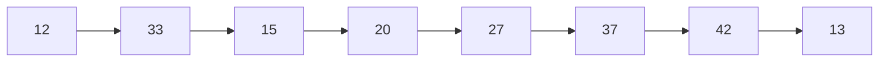

# 概述

## 分布式系统定义

由多个通过**网络互联**的独立自治的**计算节点**组成。这些计算节点基于**消息传递机制**进行**互相协作**，已完成共同的目标

从用户来看，分布式系统是计算结点内聚在一起的一个整体 

计算节点：计算机、进程 、线程、虚拟机、有限状态机

独立自治：每个节点有自己的CPU、时钟

消息传递：并非内存共享模型


节点没有公共状态、必须通过消息写作。通信复杂度是影响效率重要因素。设计时必须应对局部失效、消息延迟/丢失错误


不同层次的并行运算

指令集并行、CPU多核并行、多CPU并行（一致性/非一致性）、GPU并行、多机并行（消息传递）

## 目的

1. 提高计算能力
2. 提高存储能力
3. 提高网络吞吐能力
4. 提高可靠性
5. 提高安全性
6. 提高可靠性
7. 实现资源共享
8. 实现跨越时空的协同服务

可扩展性（垂直、水平）

容错性

透明性

开发性

安全性

可维护性

## 挑战

异构性：软硬件差异

自治

局部视图

开放性：数目在变动，网络在变动

可扩展性

故障处理

安全性

透明性

服务质量保证

### 节点染色



相邻颜色不同

Repeat forever：

- Send message c to all neighbours

- Receive message from all neighbours. Let M be the set of message received.

- $If\ c \notin \{1,2,3\}\ \and\ c > max\ M: $

  $Let\ c \leftarrow min(\{1,2,3\}-M)$     

### 数据库备份

分布式一致性：Paxos协议、Raft协议


# Java  Socket

## 线程

线程：有独立上下文，独立CPU寄存器，共享地址，主函数结束生命结束

Java线程 Thread类重载run函数

```java
class MyThread extends Thread{
    //输出1-ticket
    private int ticket;

    MyThread(int t){
        ticket = t;
    }

    public void run(){
        for(int i=0; i < ticket; i++){
            System.out.println(this.getName()+" sold ticket"+ i);
        }
    }
}
```

```java
public class ThreadTest{
    //主函数
    public static void main(String[] args){
        MyThread t1 = new MyThread(10);
        MyThread t2 = new MyThread(15);
        MyThread t3 = new MyThread(30);
        t1.start();
        t2.start();
        t3.start();
    }
}
```

## Socket服务器

Java输入输出流

stream字节、reader/writer字符、buffer缓冲


```java
import java.io.*;
import java.net.*;

public class ServerThread extends Thread {
    Socket socket = null;

    public ServerThread(Socket socket) {
        this.socket = socket;
    }
	//读信息，打印到命令行，将信息发回去
    public void run() {
        InputStream is = null;
        InputStreamReader isr = null;
        BufferedReader br = null;
        OutputStream os = null;
        PrintWriter pw = null;
        try {
            is = socket.getInputStream();
            isr = new InputStreamReader(is);
            br = new BufferedReader(isr);
            os = socket.getOutputStream();
            pw = new PrintWriter(os);
            String info = null;
            while ((info = br.readLine()) != null) {
                System.out.println("Message from client:" + info);
                System.out.println(info);
                pw.flush();
            }
        } catch (IOException e) {
            e.printStackTrace();
        } finally {
            try {
                if (pw != null)
                    pw.close();
                if (os != null)
                    os.close();
                if (br != null)
                    br.close();
                if (isr != null)
                    isr.close();
                if (is != null)
                    is.close();
                if (socket != null)
                    socket.close();
            } catch (IOException e) {
                e.printStackTrace();
            }
        }
    }
}

```

主函数

```java
import java.io.*;
import java.net.*;

public class MultiThreadEchoServer {
    public static void main(String[] args) throws Exception{
        //开始监听
        ServerSocket listenSocket = new ServerSocket(8189);
        Socket socket = null;
        int count = 0;
        System.out.println("Server listening at 8189");

        while(true){
            //取出一个连接记录
            socket = listenSocket.accept();
            count++;
            System.out.println("The total number of clients is "+count+".");
            ServerThread serverThread = new ServerThread(socket);
            serverThread.start();
        }
    }
}
```

## Socket 客户端

由于老师给的实例没有发送，没法测试服务器是否正常工作，写了一个很简单的客户端

```java
import java.io.*;
import java.net.*;

public class SendThread extends Thread {
    Socket socket = null;

    public SendThread(Socket socket) {
        this.socket = socket;
    }

    public void run() {
        OutputStream os = null;
        PrintWriter pw = null;
        try {
            os = socket.getOutputStream();
            pw = new PrintWriter(os);
            pw.println("hello");
        } catch (IOException e) {
            e.printStackTrace();
        } finally {
            try {
                if (pw != null)
                    pw.close();
                if (os != null)
                    os.close();
                if (socket != null)
                    socket.close();
            } catch (IOException e) {
                e.printStackTrace();
            }
        }
    }

    public static void main(String[] args) throws Exception {
        int threadnum = 10;
        for (int i = 0; i < threadnum; ++i) {
            Socket socket = new Socket("localhost", 8190);
            System.out.println("Server send to 8190");
            SendThread serverThread = new SendThread(socket);
            serverThread.start();
        }
    }
}
```

## 线程池

ThreadPoolExecutor 线程池

 public ThreadPoolExecutor(int corePoolSize, 

​            int maximumPoolSize,

​            long keepAliveTime,

​            TimeUnit unit,

​            BlockingQueue<Runnable> workQueue,

​            ThreadFactory threadFactory,

​            RejectedExecutionHandler handler)

参数说明

（1）corePoolSize 核心线程数量

即使没有任务执行，核心线程也会一直存活

线程数小于核心线程时，即使有空闲线程，线程池也会创建新线程执行任务

设置allowCoreThreadTimeout=true时，核心线程会超时关闭

（2）maximumPoolSize 最大线程数

当所有核心线程都在执行任务，且任务队列已满时，线程池会创建新线程执行任务。

当线程数=maxPoolSize,且任务队列已满，此时添加任务时会触发RejectedExecutionHandler进行处理。

（3）keepAliveTime TimeUnit 线程空闲时间

如果线程数>corePoolSize，且有线程空闲时间达到keepAliveTime时，线程会销毁，直到线程数量=corePoolSize

如果设置allowCoreThreadTimeout=true时，核心线程执行完任务也会销毁直到数量=0

```java
import java.util.concurrent.*;

public class ThreadPoolTest {
    //5个核心线程，10最大线程
    public static void main(String[] args){
        ThreadPoolExecutor executor = new ThreadPoolExecutor(5, 10, 200, TimeUnit.MILLISECONDS, new ArrayBlockingQueue<>(5));
        //TimeUnit.MILLISECONDES颗粒度
        for(int i = 0; i < 15; i++){
            MyTask myTask = new MyTask(i);
            executor.execute(myTask);
            System.out.println("The number of threads in the ThreadPool:"+executor.getPoolSize());
            System.out.println("The number of tasks in the Queue:"+executor.getQueue().size());
            System.out.println("The number of tasks completed:"+executor.getCompletedTaskCount());
        }
        executor.shutdown();
        
    }
}

class MyTask implements Runnable {
    private int taskNum;
    public MyTask(int num){
        this.taskNum = num;
    }
	// 简单的求和
    @Override
    public void run(){
        int sum = 0;

        System.out.println("Task" +taskNum+"is running!");
        
        try {
            for(int i = 0; i < 15; i++)
                sum += i;
            Thread.currentThread().sleep(4000);
        } catch(InterruptedException e){
            e.printStackTrace();
        }
        System.out.println("Task "+taskNum+" has been done!");
    }
}
```


# maven

```mvn
#在目录下构建项目
$ mvn clean package
#在target/classes下运行
$ java com.xdu.App

mvn exec:java -Dexec.mainClass="dc.sockettest.EchoServer"
```

maven报错 不再支持原选项5

```
在prom中添加
<properties>
        <project.build.sourceEncoding>UTF-8</project.build.sourceEncoding>
        <maven.compiler.encoding>UTF-8</maven.compiler.encoding>
        <java.version>11</java.version>
        <maven.compiler.source>11</maven.compiler.source>
        <maven.compiler.target>11</maven.compiler.target>
</properties>

```


事件驱动技术

事件驱动器（选择器）同时监视多个Channel（Socket）

适合处理大量短事务

# RPC

远程过程调用PRC

应用程序可以像调用本地节点上的过程(子程序) 那样去调用一个远程节点上的子程序。

同步调用


远程方法调用RMI

面向对象，调用对象方法。方法的参数可能是远程。不严格区分RMI，RPC


stub桩代码/proxy代理：调用者

skeleton骨干：被调用者

二者利用socket通信


接口定义语言IDL：跨编程语言

gRPC Google开源RPC中间件

通信协议基于HTTP协议，对象序列化基于ProtoBuf序列化协议


Protobuf

1. .proto文件
2. 代码生成工具根据proto生成所有要序列化对象的工厂类
3. 将工厂类源代码增加到自己的应用
4. 需要可序列化对象时，用工厂对象创建
5. 调用对象的writeTo方法将对象序列化
6. 工厂对象parseFrom可以反序列化

工厂


gRPC

1. .proto
2. Protobuf生成要序列化的工厂类
3. gRPC生成RPC的stub和skeleton
4. 将源程序加入
5. 服务端实现skeleton核心逻辑 监听服务器
6. 客户端实现


web service

1. HTTP传输层协议
2. 将多个第三方服务集成
3. 客户端-服务器
4. 实现面向服务构架SOA Service-oriented(以...为方向) Architecture
5. 包含XML HTTP SMTP TCP YDP SOAP WSDL 

服务端

1. 定义Web服务接口
2. 生成WSDL 
3. 实现web服务类
4. web服务类绑定web服务器
5. web服务注册UDDI中心

客户端

1. 根据UDDI查找接口定义WSDL
2. 根据WSDL生成Web服务代理类
3. 根据Web服务代理类调用


中间件

1. 降低耦合度
2. 提高容错
3. 提高拓展性

消息中间件

异步通信：发送发任意时刻发送，不必接收方上线。接收方不必阻塞方式等待

节点通过虚拟总线相连


消息队列通信模式：生产者消费者

消息一旦取走，从队列删除

出队按照负载均衡策略


主题/订阅通信模式

多个订阅同一主题消费者可以同时接受

广播组播

ActiveMQ


# 分布式存储

提高存储量、吞吐量（水平可拓展）

提高可靠（用）性 （容错性）

降低访问延时（CDN）

提高效率


多副本

1. 硬件成本
2. 一致性

分区partition与切片shard

1. 跨区查询
2. 合理、动态分区
3. 负载均衡
4. 分布式事务处理


基于领导者的复值 active/passive，master/slave，primary/backup

读多写少。写数据发送给领导者，领导者发给其他。客户可以通过追随、领导查询

同步复制：确定所有从节点都写入，才完成写入

异步复制：不等待从节点，主节点写完后，确认写完

混合复制

流水线（HDFS）：大文件拆分 （滑动窗口


主从复制更新命令的级别

高级别（如SQL命令）

低级别（如CPU指令）

中级别（如数据库更新日志中的数据更新指令） 效率实现复杂度的平衡点，更容易实现原子操作


多副本一致性

1. 多客户端同时读写
2. 分布式存储节点网络不可靠
3. 部分存储节点失效

1. 强一致性：线性一致性/原子一致性（多个线程访问一个寄存器）
2. 顺序一致性
3. 因果


CAP定理


•Consistensy(一致性)：不同节点上数据的强一致性

•Partition Tolerance(割断容忍性)：允许部分节点与其它节点断裂

•Availability(可用性)：发出的请求在规定时间段内总能返回结果（请求响应延时短，可用性高；否则可用性低）

三者取二


BASE理论：对CAP一致性 可用性权衡的结果

基本可用（Basically Available）：在出现故障的时候，允许损失部分可用性，保证核心可用。

软状态（Soft State）：允许系统中的数据存在中间状态，允许系统在多个不同节点的数据副本存在更新延时。

最终一致性（Eventually Consistent）：不可能一直处于软状态，在一定期限后应当保证所有副本保持数据一致性，从而达到数据的最终一致性


数据分区

避免出现偏斜(skew)和热点(hot spot)问题。

根据主键范围进行分区

根据主键的哈希值进行分区


理想哈希函数的特性：

①确定性：相同的输入会产生相同的输出；

②随机性

③无碰撞性

